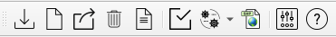
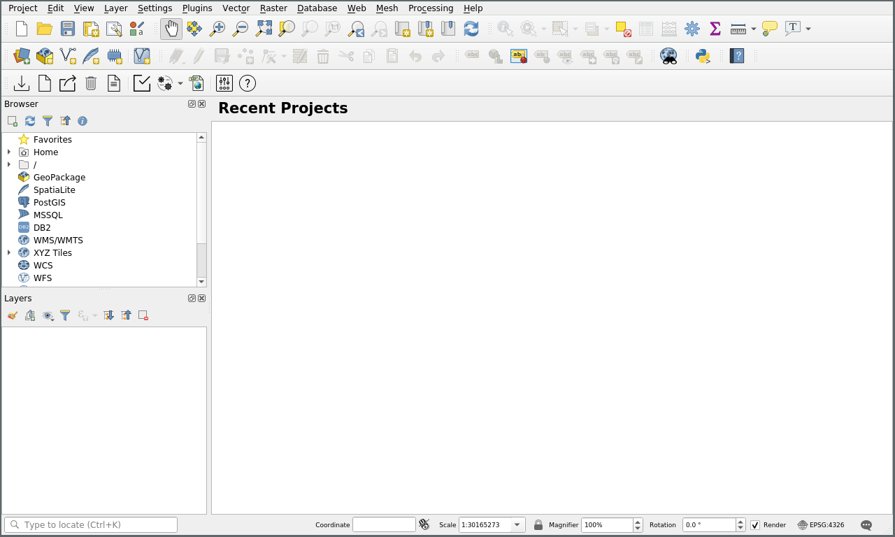
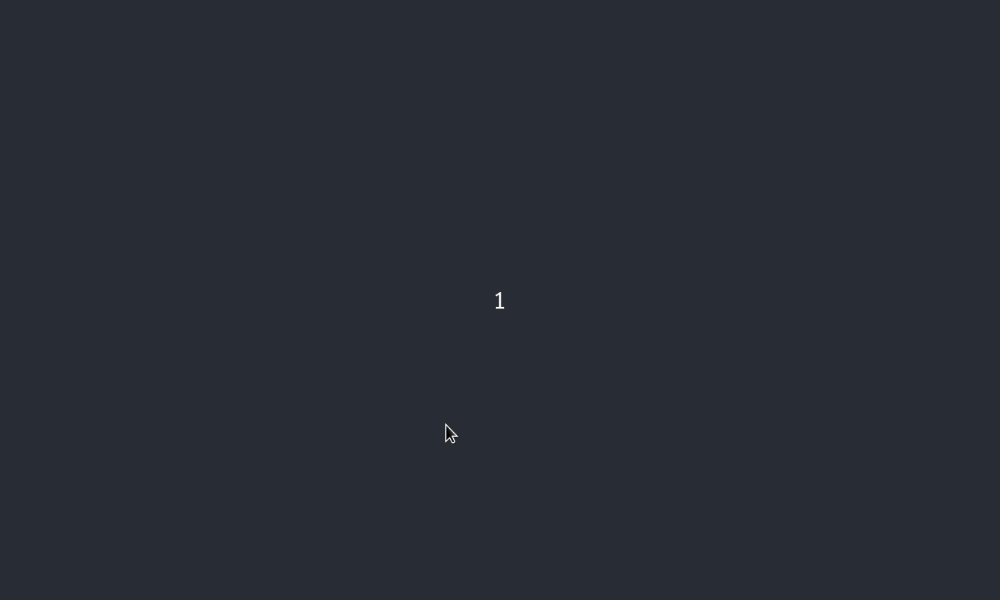
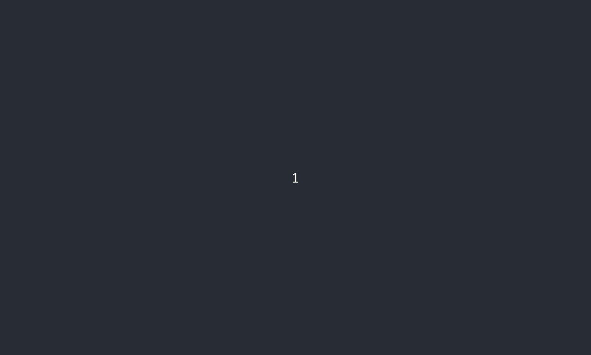
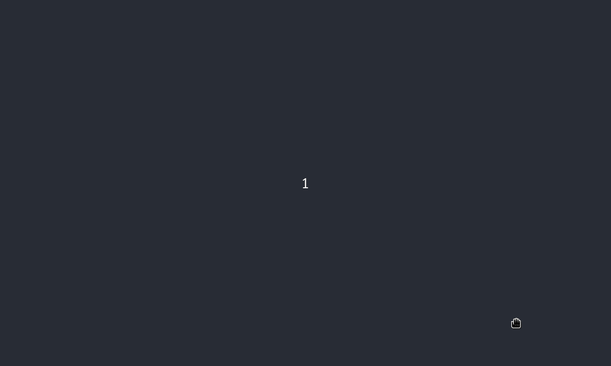
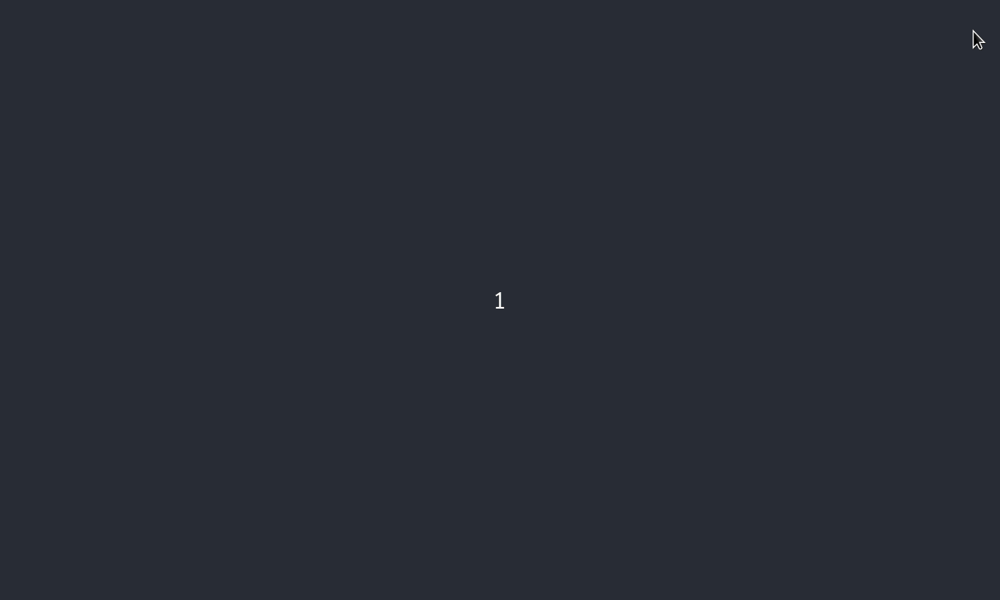
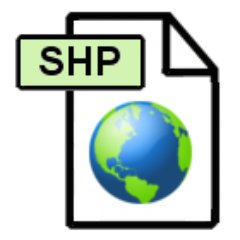

Se il plugin è correttamente installato, apparirà in QGIS la toolbar di
Veriti.

I pulsanti sono, da sinistra a destra:

- Importa INTERLIS
- Crea progetto vuoto
- Esporta INTERLIS
- Elimina progetto dal db
- Crea progetto da database
- Verifica vincoli
- Menu con i seguenti pulsanti
  - Configura associazioni zone (scelta di default)
  - Configura associazioni elementi
  - Riscrivi tutte le associazioni
  - Configura attributi zone
  - Configura attributi elementi
- Importa geometrie da Shapefile
- Impostazioni
- Aiuto

## Importa INTERLIS

*Pulsante importazione INTERLIS*

Tramite questo pulsante, è possibile aprire il dialogo che permette di
salvare nella banca dati i dati contenuti in un file INTERLIS .itf
(proveniente ad esempio dal portale cantonale).

Nel dialogo è necessario selezionare il file contenente i dati e il nome
del progetto Veriti nella banca dati (tecnicamente si tratta del nome
dello schema). Il nome deve essere minuscolo, iniziare con una lettera e
non deve contenerea spazi e caratteri speciali (ad eccezione del
carattere "\_").

## Crea progetto vuoto

*Pulsante creazione progetto vuoto*

Tramite questo pulsante, è possibile creare un progetto Veriti vuoto
nella banca dati. Viene creata nella banca dati, la struttura delle
tabelle secondo il modello cantonale, che permette di registrare in
seguito i dati del piano regolatore.

## Esporta INTERLIS

*Pulsante esportazione INTERLIS*
Tramite questo pulsante è possibile esportare i dati della banca dati in
un file INTERLIS (.itf) da poter salvare o trasferire (ad esempio sul
portale cantonale).

Nel dialogo è necessario selezionare il progetto Veriti (schema nella
banca dati) che contiene i dati e un file dove salvarli.

## Elimina progetto dal database

*Pulsante eliminazione progetto dal database*

Questo pulsante permette di eliminare un progetto Veriti dalla banca
dati. Nel dialogo va selezionato tra i progetti presenti, quello da
eliminare. Questa operazione corrisponde a cancellare
(`DROP CASCADE`) uno schema nella banca dati.

## Crea progetto da database

*Pulsante creazione progetto QGIS da database*

Questo pulsante serve per generare un progetto QGIS contenente tutti i
layer previsti dal modello cantonale (vedi capitolo [Struttura dei
dati](#struttura_dei_dati)) collegati con i dati presenti nella banca
dati. Il progetto QGIS può venir personalizzato (senza rinominare o
cancellare i layer creati da Veriti) ed utilizzato in futuro senza dover
per forza rigenerare il progetto tramite questa funzione. Veriti capisce
se il progetto attualmente aperto in QGIS è un progetto Veriti e tutti
gli strumenti funzionano automaticamente senza bisogno di altre
operazioni.

## Verifica vincoli

*Pulsante per apertura dialogo verifica vincoli*

Questo pulsante apre la finestra di dialogo per la verifica dei vincoli
(vedi capitolo [Vincoli di integrità tra i
dati](#vincoli_di_integrita)). Dal dialogo è possibile verificare
manualmente un vincolo alla volta oppure tutti assieme. Eseguendo i
vincoli singolarmente, in caso di risultato negativo, a dipendenza del
vincolo verrà indicato il numero di elementi sbagliati, verranno
selezionati gli elementi nei layer in questione o verrà creato un layer
temporaneo con gli errori (ad esempio nel caso dei buchi tra geometrie).

## Menu funzioni speciali di associazione

Il pulsante delle funzioni speciali di associazione, si tratta di un
menu con cinque diverse funzionalità.

### Configura associazioni zone (scelta di default)

*Pulsante per apertura tabella di associazione
zone*

Questo pulsante apre la tabella di associazione delle zone comunali a un
piano grafico. Permette di definire per ogni zona, con quale simbolo le
geometrie appartenenti a quella zona, verranno mostrate sui differenti
piani grafici presenti. È possibile anche rimuovere le associazioni,
semplicemente cancellando il simbolo in questione. Per la scelta del
simbolo, è possibile inserire direttamente il codice del simbolo nella
tabella oppure selezionarlo tramite il dialogo di selezione dei simboli
di QGIS. Nel dialogo vanno unicamente selezionati i simboli dall\'elenco
mostrato. Nella banca dati viene registrato il codice del simbolo. Ogni
modifica al simbolo fatta in questo dialogo, non viene registrata.

### Configura associazioni elementi

*Pulsante per apertura tabella di associazione
elementi*

Questo pulsante apre la tabella di associazione degli elementi comunali
a un piano grafico.

Il funzionamento corrisponde a quello della tabella per le zone comunali

### Riscrivi tutte le associazioni

*Pulsante per riscrivere tutte le associazioni*

Questo pulsante serve per riscrivere nella banca dati (in particolare
nelle tabelle che associano le geometrie con i piani grafici) tutte le
relazioni.

Quando viene copiata una geometria, quest\'ultima, non avrà un record
nella tabella che associa le geometrie con i piani grafici. Premendo
questo pulsante, vengono create le associazioni per tutte le geometrie e
quindi anche quella copiata verrà associata come le altre con la stessa
definizione comunale.

### Configura attributi zone

*Pulsante per apertura tabella di configurazione attributi
zone*

Questo pulsante apre la tabella per la configurazione degli attributi
delle zone comunali. Per ogni zona, viene visualizzata una colonna per
ogni attributo definito dalla zona cantonale e viene indicato se
l\'attributo è obbligatorio o meno tramite il simbolo di attenzione
nella cella della tabella.

### Configura attributi elementi

*Pulsante per apertura tabella di configurazione attributi
elementi*

Questo pulsante apre la tabella per la configurazione degli attributi
degli elementi comunali.

Il funzionamento corrisponde a quello della tabella per le zone comunali

## Importa geometrie da Shapefile

*Pulsante importazione geometrie da Shapefile*

Questo pulsante permette di importare geometrie da uno Shapefile in un
layer geometrico (senza attribuzione a un piano grafico), mantenendo gli
attributi specificati. A differenza di copiare e incollare le geometrie
in QGIS da uno shapefile, questa funzione, permette di creare
automaticamente la relazione della geometria con la definizione
comunale.

Il formato Shapefile, impone un limite massimo alla lunghezza dei nomi
degli attributi delle geometrie, di 10 caratteri. Nomi più lunghi
vengono troncati. Nel modello dati cantonale, la maggior parte dei campi
ha più di dieci caratteri. La funzione importa Shapefile interpreta i
nomi secondo la tabella seguente.

| Campi nello Shapefile | Campi nel modello cantonale | Contenuto |
| --- | --- | --- |
|Campo che inizia con `nome` | `nome_oggetto` | Una stringa di testo rappresantate il nome della geometria (spesso viene utilizzato il nome della definizione comunale anche come nome della geometria)|
|Campo che inizia con `osse` | `osservazioni` | Una stringa di testo con le osservazioni|
|Campo che inizia con `etic` | `etichetta_oggetto` | Una stringa con l'etichetta (label) della geometria|
|Campo che inizia con `se_ab` | `se_abrogazione` |    `1` (cifra uno) se la geometria è abrogata, altrimenti `0` (cifra zero)|
|Campo che inizia con `se_nu` | `se_nuovo` |          `1` (cifra uno) se la geometria è nuova, altrimenti `0` (cifra zero)|
|Campo `elemento_c` oppure `zona_comun`   `id_oggetto_elemento_comune` (se si importano elementi punto, linea o poligono) rispettivamente `id_oggetto_zona_comune` (se si importano zone base o zone sovrapposte)   Il codice letterale dell'elemento comune rispettivamente zona comune. Ad esempio `RE` per definizione "Zona residenziale estensiva". Il codice deve essere scritto esattamente come conenuto nella tabella elemento_comune rispettivamente zona_comune |

Per poter importare uno shapefile con la funzione di VeriTi, tutti i
campi indicati nella tabella devono essere presenti. Il nome del campo
può essere scritto indifferentemente in maiuscolo o minuscolo. Possono
essere presenti altri campi, verranno semplicemente ignorati da Veriti.

## Impostazioni

*Pulsante per apertura dialogo impostazioni*

## Aiuto

*Pulsante per apertura manuale utente*
